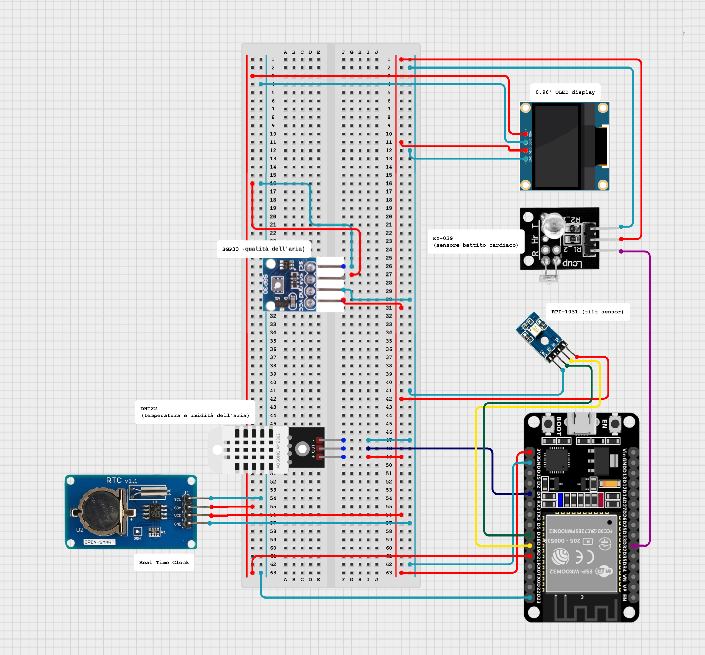

# Sistema di Monitoraggio Multiparametrico ESP32

## Descrizione del Progetto

Sistema IoT basato su microcontrollore ESP32 per il monitoraggio in tempo reale di parametri ambientali e biometrici, ispirato al design del dispositivo "Klockis" di IKEA. Il dispositivo integra multiple tipologie di sensori e presenta un'interfaccia utente dinamica basata sull'orientamento fisico del dispositivo, replicando e ampliando le funzionalità dell'orologio multifunzione svedese con capacità avanzate di monitoraggio.

**Corso**: Sistemi Embedded  
**Anno Accademico**: 2024/2025  
**Piattaforma**: ESP32 DevKit v1  
**Licenza**: GPL (GNU General Public License)

## Architettura del Sistema

### Componenti Hardware

| Componente | Modello | Protocollo | Funzione |
|------------|---------|------------|----------|
| Microcontrollore | ESP32 DevKit v1 | - | Unità di controllo principale |
| Sensore T/H | DHT22 | GPIO | Temperatura e umidità ambientale |
| Real Time Clock | DS3231 | I2C | Timestamp accurati |
| Sensore Cardiaco | KY-039 | ADC | Fotopletismografia (PPG) |
| Sensore Orientamento | RPI-1031 | GPIO | Rilevamento inclinazione 4-posizioni |
| Display | OLED SSD1306 0.96" | I2C | Interfaccia utente |


## Funzionalità Implementate

### 1. Acquisizione Dati Multi-Sensore
- **Temperatura e Umidità**: Campionamento DHT22 ogni 1000ms
- **Battito Cardiaco**: Algoritmo PPG con media mobile e filtro fisiologico (30-200 BPM)
- **Timestamp**: Sincronizzazione temporale tramite RTC DS3231
- **Orientamento**: Rilevamento posizione in tempo reale

### 2. Interfaccia Utente Dinamica
Il sistema presenta 4 modalità di visualizzazione selezionabili tramite rotazione fisica:

| Orientamento | Modalità | Dati Visualizzati |
|--------------|----------|-------------------|
| 0 | Orologio | Data e ora corrente |
| 1 | Qualità Aria | Parametri ambientali simulati |
| 2 | Battito Cardiaco | BPM con animazione e traccia ECG |
| 3 | Ambiente | Temperatura e umidità |

### 3. Gesture Recognition
Sistema di riconoscimento pattern per attivazione modalità sleep:
- **Pattern**: Sequenza DESTRA-SINISTRA-DESTRA-SINISTRA ripetuta 2 volte
- **Timeout**: Reset automatico dopo 3 secondi di inattività
- **Sleep Mode**: Modalità a basso consumo con display ridotto

## Requisiti Software

### Librerie Arduino
```cpp
#include <Wire.h>              // Comunicazione I2C
#include <Adafruit_GFX.h>      // Grafica display
#include <Adafruit_SSD1306.h>  // Driver OLED
#include <DHT.h>               // Sensore temperatura/umidità
#include <RTClib.h>            // Real Time Clock
```

## Schema Circuitale



*Schema ricostruito digitalmente mostrante tutte le connessioni hardware del sistema*

---

**Autore**: Nacubuan Andrei Joshua 
**Data**: Luglio 2025  
**Licenza**: GPL v3.0 - Questo progetto è rilasciato sotto licenza libera GNU General Public License